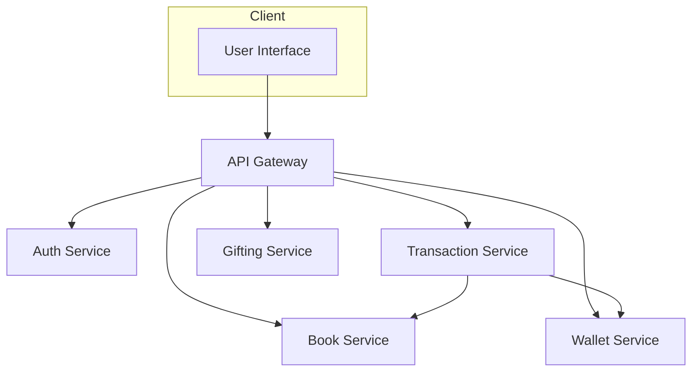

# 📚 Booktopia — Microservice E-commerce Platform

[](https://golang.org)
[](https://opensource.org/licenses/MIT)

**Booktopia** adalah platform e-commerce buku modern yang dibangun dengan arsitektur **Microservice** menggunakan **Go (Golang)**. Dirancang untuk skalabilitas, modularitas, dan kemudahan pengembangan, Booktopia menyatukan layanan-layanan independen untuk menangani otentikasi, transaksi, dompet digital, donasi, dan lainnya — semuanya terintegrasi dengan mulus melalui API Gateway.

---

## 🧩 Arsitektur Sistem

Booktopia terdiri dari beberapa service yang saling berkomunikasi melalui **REST API** dan **gRPC**, dengan **API Gateway** sebagai satu-satunya pintu masuk eksternal.



### 📦 Daftar Layanan

| Layanan           | Teknologi Utama                                         | Deskripsi                                                                 |
|-------------------|--------------------------------------------------------|--------------------------------------------------------------------------|
| **Gateway**       | Echo, REST, JWT, Logrus                                | Pintu gerbang utama, routing, otentikasi, translasi REST ↔ gRPC         |
| **Auth**          | Echo, REST, PostgreSQL, GORM, Mailtrap                 | Registrasi/Login, manajemen JWT, notifikasi email                       |
| **Book**          | Echo, REST, MongoDB                                    | Manajemen data buku (CRUD, ketersediaan)                                |
| **Wallet**        | gRPC, PostgreSQL, GORM                                 | Top-up, debit/kredit, cek saldo dompet digital                          |
| **Transaction**   | gRPC, PostgreSQL, GORM, Apache Kafka                   | Proses pembelian asinkron, validasi buku dan saldo                      |
| **Gifting**       | gRPC, PostgreSQL, GORM                                 | Donasi/hadiah buku antar pengguna                                       |

---

## 🚀 Fitur Unggulan

✅ JWT Authentication & Role-based Access (Admin/User)  
✅ CRUD Buku via REST API  
✅ Dompet Digital: Top-up, Cek Saldo, Transaksi  
✅ Transaksi Asinkron via **Apache Kafka**  
✅ Fitur Donasi Buku ke pengguna lain  
✅ Notifikasi Email (via Mailtrap)  
✅ Logging Terpusat di Gateway  
✅ Dokumentasi API Swagger Interaktif  
✅ Unit Test Lengkap (Service & Handler Layer)  
✅ Scheduler (Cron Job) untuk hadiah yang *expired*

---

## 🛠️ Tech Stack

- **Bahasa**: Go 1.22+
- **Framework**: Echo (REST), gRPC
- **Database**: PostgreSQL (GORM), MongoDB
- **Broker**: Apache Kafka
- **Container**: Docker, Docker Compose
- **Testing**: Testify, Mocking
- **Dokumentasi**: Swagger (Swaggo)
- **Utilitas**: JWT, Logrus, Cron

---

## ⚙️ Setup Lokal

### 📌 Prasyarat

- Go v1.21+
- Docker & Docker Compose
- PostgreSQL & MongoDB

### 📁 Clone Repositori

```bash
git clone <url-repositori-anda>
cd <nama-folder-proyek>
```

### 🔧 Inisialisasi Workspace

```bash
go work init ./auth-service ./book-service ./gateway-service ./transaction-service ./wallet-service ./gifting-service
```

### 📄 Konfigurasi `.env`

Setiap service memiliki file `.env` masing-masing. Contoh konfigurasi tersedia di masing-masing folder.

---

## ▶️ Menjalankan Proyek

### 1. Jalankan Kafka & Zookeeper

```bash
docker-compose up -d
```

### 2. Jalankan Setiap Service (6 Terminal)

```bash
# Terminal 1
go run ./auth-service/cmd/main.go

# Terminal 2
go run ./book-service/cmd/main.go

# Terminal 3
go run ./wallet-service/cmd/main.go

# Terminal 4
go run ./transaction-service/cmd/main.go

# Terminal 5
go run ./gifting-service/cmd/main.go

# Terminal 6
go run ./gateway-service/cmd/main.go
```

---

## 📖 Dokumentasi API

Swagger UI tersedia setelah `gateway-service` aktif:

👉 [http://localhost:8000/swagger/index.html](http://localhost:8000/swagger/index.html)

---

## 👨‍💻 Kontribusi

Pull request sangat terbuka! Pastikan kode Anda sudah diuji, terlinting, dan terdokumentasi. Jangan ragu untuk membuka *Issue* jika menemukan bug atau ingin request fitur baru.

---

## 📄 Lisensi

MIT License © 2025 — [Nama Anda / Tim Anda]

---

🚀 *Booktopia — Simplifying Book Commerce through Microservices!*